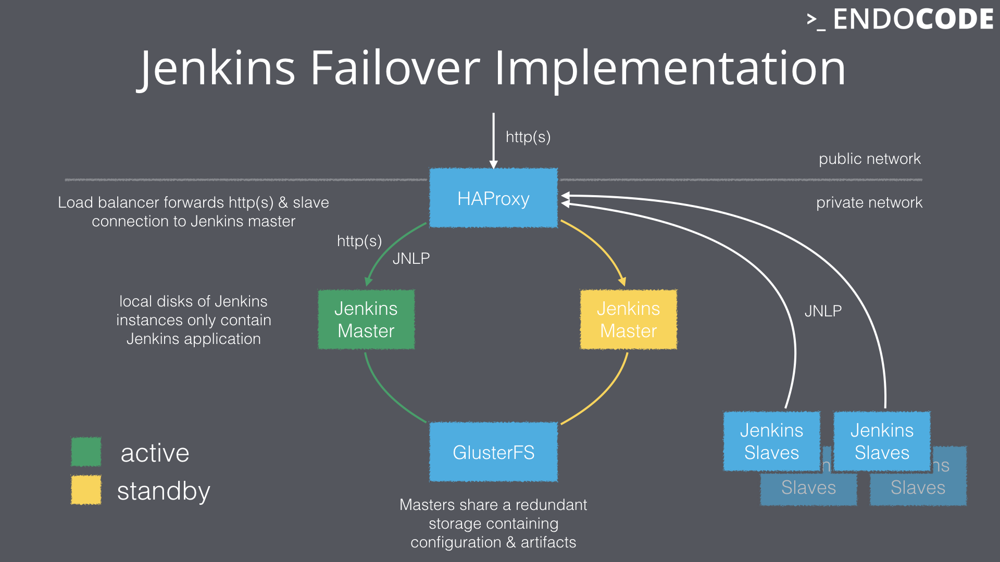

# jenkins-failover-demo
Proof of Concept for redundant setup of Jenkins CI

## implemenatation

2 Jenkins masters (1 active, 1 standby) that mount a shared GlusterFS storage behind a HAProxy. Slaves connect via the Swarm plugin and locally running swarm cli.

### run

`vagrant up`

### clean up

`vagrant destroy -f`

### CI run
`vagrant up; ruby status.rb ci; vagrant destroy -f`